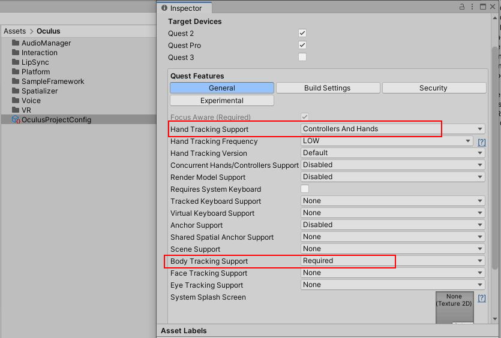
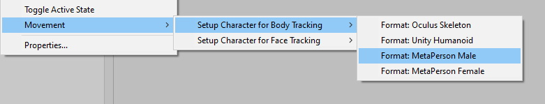

# MetaPerson - Body Tracking From Movement SDK Sample
The sample demonstrates how to use [Body Tracking from the Movement SDK](https://developer.oculus.com/documentation/unity/move-body-tracking/) with [MetaPerson](https://metaperson.avatarsdk.com/) avatars.

### Requirements
- Unity 2021.3.19f1 or newer
- [Oculus Integration SDK](https://developer.oculus.com/downloads/package/unity-integration/) v56.0 or newer

## Getting Started
1. Clone this repository to your computer
2. Open the project in Unity 2021.3.19f1 or newer.
3. Import [Oculus Integration SDK](https://developer.oculus.com/downloads/package/unity-integration/) v56.0 or newer into the project.
4. Set **Hand Tracking Support** to **Controllers And Hands** and **Body Tracking Support** to **Required** for OculusProjectConfig (Assets -> Oculus).

5. Open the `Assets/AvatarSDK/MetaPerson/QuestHandTrackingSample/Scenes/MetaPersonQuestHandTrackingSample.unity` scene.

### How To Configure MetaPerson Model For Body Tracking
1. Add a MetaPerson avatar from the [MetaPerson](https://metaperson.avatarsdk.com/) into a unity scene.
2. Right click on the model in the Hierarchy window and choose `Movement -> Setup Character for Body Tracking -> Format: MetaPerson Male`. (Choose `Format: MetaPerson Female` if you are using the MetaPerson Female model.)

3. It will add the [OVRMetaPersonSkeleton](./Assets/AvatarSDK/MetaPerson/QuestHandTrackingSample/Scripts/OVRMetaPersonSkeleton.cs) component to the model and do initial setup.
