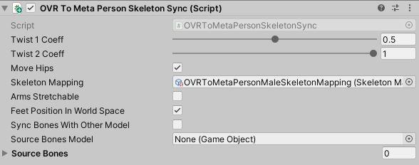

# MetaPerson - Body Tracking From Movement SDK Sample
The sample demonstrates how to use [Body Tracking from the Movement SDK](https://developer.oculus.com/documentation/unity/move-body-tracking/) with [MetaPerson](https://metaperson.avatarsdk.com/) avatars.

### Requirements
- Unity 2022.3.17f1 or newer
- [Meta XR Core SDK](https://assetstore.unity.com/packages/tools/integration/meta-xr-core-sdk-269169) and [Meta XR Interaction SDK OVR](https://assetstore.unity.com/packages/tools/integration/meta-xr-interaction-sdk-ovr-integration-265014) v60 or newer
- [Movement SDK](https://github.com/oculus-samples/Unity-Movement) v4.2.1 or newer

## Getting Started
1. Clone this repository to your computer
2. Open the project in Unity 2022.3.17f1 or newer.
3. Set **Hand Tracking Support** to **Controllers And Hands** and **Body Tracking Support** to **Required** for OculusProjectConfig (Assets -> Oculus).

4. Build and run any of the sample scenes: 
- `Assets/AvatarSDK/MetaPerson/QuestHandTrackingSample/Scenes/MetaPersonQuestHandTrackingSample.unity`
- `Assets/AvatarSDK/MetaPerson/QuestHandTrackingSample/Scenes/MetaPersonQuestHipPinningSample.unity`

### How To Configure MetaPerson Model For Body Tracking
#### Configure In Editor
1. Add a MetaPerson avatar from the [MetaPerson Creator](https://metaperson.avatarsdk.com/) into a unity scene.
2. Right click on the model in the Hierarchy window and choose `Movement -> Setup Character for Body Tracking -> Format: MetaPerson Male`. Choose `Format: MetaPerson Female` if you are using the MetaPerson Female model.

3. It will add the [OVRToMetaPersonSkeletonSync](./Assets/AvatarSDK/MetaPerson/QuestHandTrackingSample/Scripts/OVRToMetaPersonSkeletonSync.cs) component to the model and do initial setup.
#### Configure Runtime Loaded Avatars 
If you load avatars at runtime, use the [MetaPersonBodyTrackingSetupHelper](./Assets/AvatarSDK/MetaPerson/QuestHandTrackingSample/Scripts/MetaPersonBodyTrackingSetupHelper.cs) for configuration.
```c#
MetaPersonBodyTrackingSetupHelper.SetupMetaPersonForBodyTracking(metaPersonMaleAvatar, MetaPersonSkeletonType.Male);
```

### OVRToMetaPersonSkeletonSync
This component applies Body Tracking data to a MetaPerson avatar. 


Key properties:
- **Twist 1 Coeff** and **Twist 2 Coeff** impact on skin twist in a region between the forearm and the hand.
- **Move Hips** specifies if the position of the Hips node is updated. If it is disabled, only rotation is applied to the Hips node.
- **Skeleton Mapping** specifies the mapping between OVR and MetaPerson skeletons.
- **Arms Stretchable** specifies if the arms length can be increased to align model's hands with OVR hands.
- **Feet Position In World Space** specifies if the feet positions in world space. Workaround for https://github.com/oculus-samples/Unity-Movement/issues/58.
- **Sync Bones With Other Model** if true, some bones positions are taken from the **Source Bones**. Otherwise, they are provided by the **OVRBody**.
- **Source Bones Model** contains a game object with the OVR Skeleton structure from which bones to sync are taken.
- **Source Bones** is a list of transforms to which bones positions/rotations are synchronized with.

## Samples
Sample scenes can be found in the `Assets/AvatarSDK/MetaPerson/QuestHandTrackingSample/Scenes` directory.
1. **MetaPersonQuestHandTrackingSample** - the basic sample that demonstrates how to configure MetaPerson avatars for body tracking.
2. **MetaPersonQuestHipPinningSample** - this sample shows how to sync MetaPerson model's bones with another model. In this case OVR rig uses HipPinning and Grounding constraints and the MetaPerson models are synchonized with this rig.
3. **MetaPersonQuestModelChangingSample** - this sample is based on the **MetaPersonQuestHipPinningSample** and demonstrates how to load MetaPerson avatars at runtime and replace the existed model on the scene.

## Support
If you have any questions or issues with the sample, please contact us <support@avatarsdk.com>.
